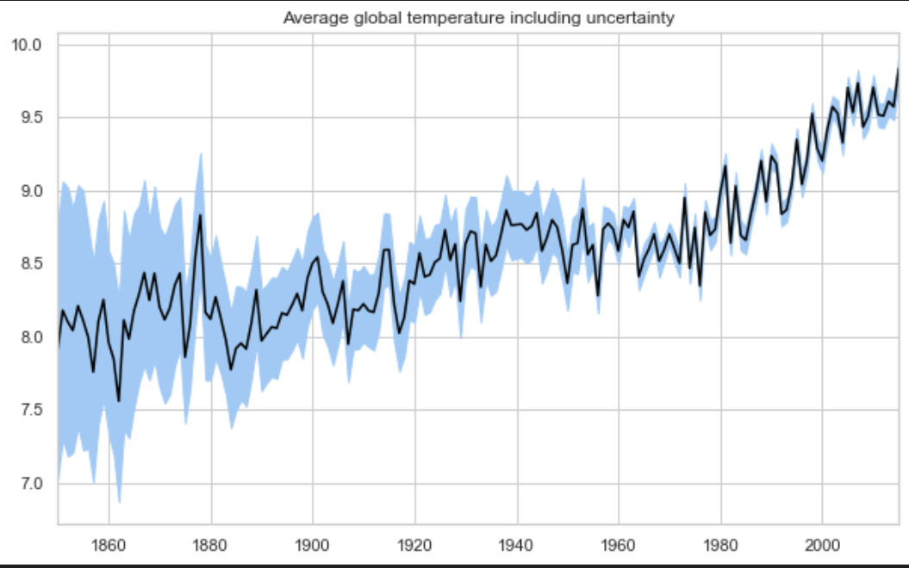

# GMAD

### Project Overview:
Some say climate change is the greatest threat of our time, others say it's a myth based on dangerous science. For my final work, I analyzed, visualized, predicted and modeled Berkeley Earth's Climate Change: Earth Surface Temperature Data dataset.

### Average global temperature including uncertainty
I visualized approximately 160 years of data according to their average, minimum and maximum values. In just 160 years, the average temperature has risen by 2 degrees Celsius.
